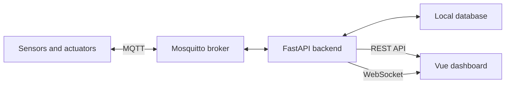

# Home Climate Management System

A modular, self-hosted climate monitoring and control system for a residential environment.

The project combines custom-built wireless sensors, embedded firmware, MQTT communication, data storage, and a local web dashboard. It starts as a temperature monitoring system and is intended to grow gradually into a complete home climate management platform.

> [!NOTE]
> This project is currently in the initial design and prototyping phase. The first milestone is temperature monitoring with one simulated or physical sensor. Heating and cooling control will be added only after the monitoring platform is stable.

## Goals

- Run completely on the local network.
- Require no cloud service or external internet access during normal operation.
- Use MQTT as the stable interface between devices and the application.
- Support custom sensor and actuator hardware.
- Remain understandable and maintainable as a hobby project.
- Allow new rooms, measurements, devices, and control strategies to be added gradually.
- Keep safety-critical protection inside the relevant hardware or manufacturer controller.

## Initial Scope

The first version will:

- Receive temperature measurements over MQTT.
- Store measurements locally.
- Display the current temperature.
- Display temperature history for the last 24 hours.
- Update the dashboard live without refreshing the page.
- Show when a sensor was last seen.
- Detect whether a sensor is online or offline.
- Support both a simulated sensor and the future custom ESP32 sensor.

The first version will not control heating, cooling, valves, pumps, or other actuators.

## System Architecture



Devices do not communicate directly with the web dashboard. They publish data to the MQTT broker. The backend validates and stores that data and exposes it to the frontend through a REST API and WebSocket connection.

This separation allows the hardware, backend, database, and user interface to evolve independently.

## Planned Technology Stack

| Layer | Technology | Purpose |
| --- | --- | --- |
| Device communication | MQTT | Lightweight interface for sensors and actuators |
| MQTT broker | Eclipse Mosquitto | Local message routing |
| Backend | Python and FastAPI | Validation, storage, API, and future control logic |
| MQTT client | Paho MQTT | Backend connection to Mosquitto |
| Database abstraction | SQLAlchemy | Keep database access separate from application logic |
| Initial database | SQLite | Simple persistent storage during early development |
| Frontend | Vue 3 and TypeScript | Local responsive dashboard |
| Charts | Apache ECharts | Interactive measurement graphs |
| Live updates | WebSockets | Push new values and status changes to the browser |
| Deployment | Docker Compose | Reproducible local development and deployment |

SQLite is appropriate for the first development phase. The database layer should be designed so that PostgreSQL or a time-series database can be introduced later without changing the MQTT interface or sensor firmware.

## Repository Structure

This repository is intended to be a monorepo containing hardware, firmware, and application software.

```text
home-climate/
├── hardware/
│   ├── sensors/
│   │   └── room-climate-sensor/
│   │       ├── kicad/
│   │       ├── mechanical/
│   │       └── docs/
│   └── actuators/
├── firmware/
│   ├── sensors/
│   │   └── room-climate-sensor/
│   └── actuators/
├── application/
│   ├── backend/
│   ├── frontend/
│   └── simulator/
├── infrastructure/
│   ├── mosquitto/
│   └── docker/
├── docs/
│   ├── architecture/
│   ├── mqtt/
│   └── decisions/
├── compose.yaml
├── .env.example
└── README.md
```

This structure keeps the complete system together while preserving clear boundaries between PCB design, embedded software, application software, and deployment configuration.

## MQTT Design

### Topic structure

MQTT topics follow this general pattern:

```text
climate/<room>/<device-id>/<message-type>
```

Initial sensor topics:

```text
climate/living-room/sensor-01/state
climate/living-room/sensor-01/availability
```

Example temperature message:

```json
{
  "temperature": 21.43,
  "timestamp": "2026-09-03T10:15:00Z"
}
```

The payload can later be extended without changing the topic:

```json
{
  "temperature": 21.43,
  "humidity": 51.2,
  "co2": 683,
  "battery_voltage": 2.84,
  "rssi": -61,
  "timestamp": "2026-09-03T10:15:00Z"
}
```

### Availability

The availability topic contains either:

```text
online
```

or:

```text
offline
```

Physical sensors should configure `offline` as their MQTT Last Will and Testament. The backend also marks a sensor offline when no valid message has been received within a configurable timeout.

### MQTT principles

- Periodic measurements normally use QoS 0.
- Important commands and acknowledgements should use QoS 1.
- Setpoints and configuration may use retained messages.
- Historical sensor measurements normally do not need to be retained by MQTT because they are stored by the backend.
- Every actuator command should have a corresponding state or acknowledgement message.
- Invalid messages must be logged and rejected without crashing the receiving service.

## Backend Responsibilities

The backend is the central application layer. It will:

- Connect and automatically reconnect to the MQTT broker.
- Subscribe to device state and availability topics.
- Validate incoming payloads.
- Record sensor and backend reception timestamps in UTC.
- Store measurements in the database.
- Maintain the latest known state of each device.
- Provide historical and current data through a REST API.
- Push new measurements and status changes through WebSockets.
- Perform online/offline detection.
- Host future supervisory climate logic.

Safety-critical functions must not depend solely on the backend, MQTT broker, network, or web dashboard.

## Initial API

The first backend version is expected to provide endpoints similar to:

```text
GET /api/health
GET /api/devices
GET /api/devices/{id}
GET /api/devices/{id}/latest
GET /api/devices/{id}/measurements?metric=temperature&hours=24
```

A WebSocket endpoint will distribute new measurements and availability changes to connected dashboards.

## Data Model

The initial database uses a generic measurement model so that new measurement types can be added without creating a new table for each sensor value.

### Devices

```text
id
external_id
name
room
device_type
mqtt_state_topic
mqtt_availability_topic
last_seen
availability
```

### Measurements

```text
id
device_id
metric
value
unit
sensor_timestamp
received_at
```

Example records:

| Device | Metric | Value | Unit |
| --- | --- | ---: | --- |
| sensor-01 | temperature | 21.43 | °C |
| sensor-01 | humidity | 51.2 | % |
| sensor-01 | co2 | 683 | ppm |
| sensor-01 | battery_voltage | 2.84 | V |

The backend reception timestamp is authoritative for communication monitoring. A sensor-provided timestamp is stored separately because a battery-powered device may temporarily have an incorrect clock.

## Dashboard

The initial dashboard will contain:

- A room overview.
- Current temperature.
- Sensor online/offline status.
- Last update time in the browser's local time zone.
- A 24-hour temperature chart.
- Clear states for missing data or a disconnected backend.
- A responsive layout for desktop and mobile browsers.

Later versions may add humidity, CO2, dew point, battery status, room setpoints, schedules, system diagnostics, and heating or cooling status.

## Docker Deployment

Docker Compose will initially manage three services:

```text
mosquitto
backend
frontend
```

Persistent storage will be used for the database and MQTT broker data. Containers should remain replaceable: rebuilding or updating a container must not remove measurement history or configuration.

The same Compose project can run on a development computer and later be moved to an always-on Linux mini PC.

## Security Principles

Although the system is local-only, it should still follow basic security practices:

- Disable anonymous MQTT access.
- Store credentials in environment variables or local secret files.
- Never commit `.env` files, passwords, runtime data, or database files.
- Use separate MQTT credentials and access rules when multiple device types are introduced.
- Restrict actuator accounts to their required command and state topics.
- Place IoT devices on a separate network or VLAN when practical.
- Do not expose the application or MQTT broker directly to the internet.

TLS is optional on a trusted local network but may be added later. Authentication and sensible network segmentation remain important even without internet exposure.

## Safety and Control Boundaries

Future climate control will use a layered design:

- Sensors measure and report environmental conditions.
- The application performs supervisory control and optimization.
- Actuator firmware applies communication timeouts and safe fallback states.
- Manufacturer controllers retain compressor, defrost, overtemperature, minimum-flow, and other equipment protection functions.

For example, future integration with the Stiebel Eltron heat pump should influence setpoints or heating demand where possible. The custom application should not bypass the heat pump's internal safety logic.

## Development Roadmap

### Phase 1 — Temperature monitoring

- Mosquitto broker
- Simulated temperature sensor
- FastAPI MQTT consumer
- SQLite persistence
- REST API and WebSocket updates
- Vue dashboard with current temperature and 24-hour graph
- Offline detection

### Phase 2 — Complete room climate sensor

- Physical ESP32-based sensor
- Temperature, relative humidity, and CO2
- Battery voltage and Wi-Fi signal strength
- Multiple sensors and rooms
- Dew-point calculation

### Phase 3 — Monitoring and diagnostics

- Configurable warning thresholds
- Long-term graphs
- Sensor health and battery warnings
- Data export and backup
- Warmtepump monitoring where a safe interface is available

### Phase 4 — Room control

- Room setpoints
- Heating schedules
- Zone valves or other secondary actuators
- Command acknowledgement
- Manual, automatic, and fail-safe modes

### Phase 5 — System optimization

- Supervisory heat-pump demand
- Heating and cooling coordination
- Dew-point protection
- Minimum on/off times
- Weather-dependent and adaptive control
- Energy monitoring and performance analysis

## Development Status

| Component | Status |
| --- | --- |
| System architecture | Defined |
| MQTT interface | Initial proposal |
| Sensor hardware | In development |
| Sensor firmware | Planned |
| MQTT broker configuration | Planned |
| Backend | Planned |
| Frontend | Planned |
| Actuator control | Future phase |
| Heat-pump integration | Future phase |

## Getting Started

The application scaffold has not yet been committed. Once the first implementation is available, this section will contain the exact setup procedure. The intended workflow will be:

```bash
git clone <repository-url>
cd home-climate
cp .env.example .env
docker compose up --build
```

The local dashboard URL, MQTT test commands, automated tests, backup procedure, and shutdown instructions will be documented as part of the first software milestone.

## Design Philosophy

This project deliberately starts with a small end-to-end implementation instead of implementing every planned feature at once. Each phase should result in a complete, testable system that continues to work while the next capability is added.

The stable boundaries are:

```text
Devices <-> MQTT <-> Backend <-> REST/WebSocket <-> Dashboard
```

Keeping these boundaries explicit makes it possible to replace a sensor, redesign the dashboard, migrate the database, or introduce new control algorithms without rebuilding the complete system.

## License

No license has been selected yet. Until a license is added, the source code is not automatically granted an open-source license.
